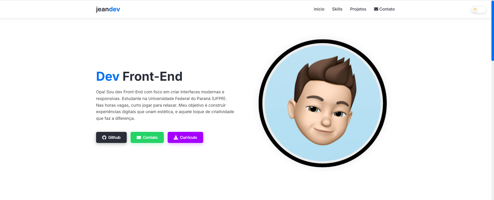

# Portfolio - Jean Felipe



Um site de portfolio moderno e responsivo desenvolvido com HTML, CSS e JavaScript, utilizando bibliotecas selecionadas para melhorar a experiência do usuário.

## Características

- **Design Responsivo**: Layout adaptável para diversos tamanhos de tela
- **Modo Escuro/Claro**: Alternância de tema com persistência de preferência
- **Animações Suaves**: Transições e animações para uma experiência refinada
- **Performance Otimizada**: Carregamento eficiente de recursos e imagens
- **Formulário de Contato**: Sistema de formulário com validação e feedback usando Netlify Forms
- **Acessibilidade**: Atributos ARIA e navegação por teclado

## Tecnologias Utilizadas

- HTML5 semântico
- CSS3 (Flexbox, Grid, Variáveis CSS)
- JavaScript 
- Netlify Forms para processamento de formulários
- WOW.js para animações de scroll
- Animate.css para efeitos de entrada
- Font Awesome para ícones
- Variáveis CSS para temas dinâmicos

## Sistema de Contato

O formulário de contato utiliza o [Netlify Forms](https://www.netlify.com/products/forms/), uma solução robusta e gratuita para processamento de formulários que funciona perfeitamente com sites estáticos. Principais características:

### Vantagens do Netlify Forms
- Processamento automático de formulários sem necessidade de backend
- Proteção contra spam integrada
- Notificações por email
- Interface administrativa para visualizar submissões
- Integração perfeita com sites hospedados no Netlify
- Gratuito para até 100 submissões por mês

## Estrutura do Projeto

```
portfolio/
│
├── img/                  # Imagens e ícones
├── index.html           # Página principal
├── styles.css           # Estilos globais
├── screenshots/         # Screenshots do projeto
└── README.md           # Documentação
```

## Instalação e Deploy

1. Clone o repositório:
```bash
git clone https://github.com/jeanzimdev/portfolio.git
```

2. Navegue até a pasta do projeto:
```bash
cd portfolio
```

3. Para desenvolvimento local:
   - Abra o arquivo `index.html` em seu navegador ou utilize um servidor local
   - Note que o Netlify Forms só funcionará após o deploy

4. Para deploy:
   - Faça o deploy do site no Netlify através do GitHub
   - O Netlify Forms será automaticamente ativado

## Desenvolvedor

**Jean Felipe** - Desenvolvedor Front-End

- [GitHub](https://github.com/jeanzimdev)
- [LinkedIn](https://www.linkedin.com/in/jean-felipe-martin-991568262/)